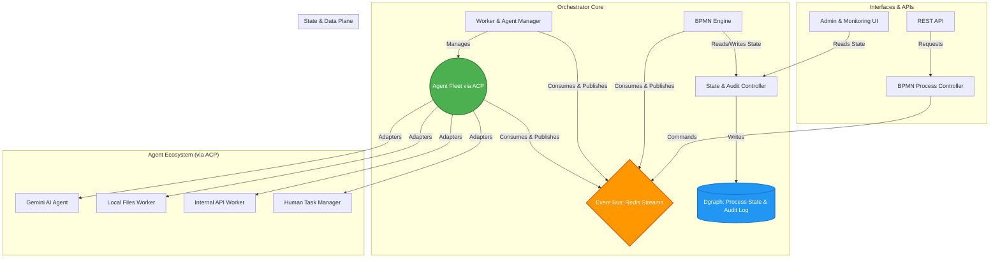

# Development Plan: OpenAMI Orchestrator - The Intelligent Process Automation Engine

## 1. Vision: The Core of OpenAMI

Its purpose is to serve as a multi-purpose, enterprise-grade reasoning engine. It is designed to model, execute, and monitor complex business processes in a manner that is robust, compliant, scalable, and intelligent. By leveraging industry standards like BPMN 2.0 and a graph-based architecture, the Orchestrator provides a transparent and auditable platform for automating even the most dynamic and long-running business scenarios.

### Core Principles:

- **Auditability & Compliance:** Every action, decision, and state change is immutably logged, creating a comprehensive audit trail that can be used to meet strict compliance requirements.
- **Resilience & Fault Tolerance:** The system is designed to be highly available and to gracefully handle failures, with built-in mechanisms for retries, rollbacks, and human-in-the-loop escalations.
- **Scalability & Performance:** The architecture is horizontally scalable by design, allowing for the independent scaling of all components to meet any workload demand.
- **Extensibility & Interoperability:** A standardized Agent-Coordinator Protocol (ACP), implemented as a JSON-RPC protocol over stdin/stdout (e.g., when Gemini runs in `--experimental-acp` mode), allows for the seamless integration of any service, from internal microservices and legacy systems to third-party APIs and advanced AI models.
- **Intelligence & Adaptability:** The Orchestrator is more than a static workflow engine; it is a reasoning engine that can use AI to make decisions, adapt processes in real-time, and automate complex, non-deterministic tasks.

## 2. Architectural Blueprint

The OpenAMI Orchestrator is built on a decoupled, event-driven architecture that ensures scalability and resilience.

## 3. Phased Development Plan

This plan breaks down the development into logical phases, starting with a solid foundation and progressively adding more advanced capabilities.

### Phase 1: Model-Driven Foundation & Security Core (In Progress)

*   **Goal:** Establish a secure, auditable, and persistent foundation based on a comprehensive, model-driven architecture.
*   **Current Status:**
    *   **Pydantic BPMN Models:** A comprehensive set of Pydantic models for BPMN 2.0 has been defined in `orchestrator/bpmn/models.py`.
    *   **Dgraph Schema Generator:** A script at `orchestrator/core/schema_generator.py` automatically generates the Dgraph schema from the Pydantic models.
    *   **Automated Schema Application:** The `apply_schema.py` script now integrates the schema generator, ensuring the Dgraph schema is always in sync with the models.
    *   Dgraph Client: Basic client implemented, but `create_process_instance` and `create_human_task` are placeholders.
    *   Redis Setup: Client implemented for messaging and dead-letter queue.
    *   Security Kernel: `SecurityManager` exists, but authentication and authorization logic is not fully implemented.
    *   Initial Orchestrator Service: `main.py` now uses a `llama_index` ReActAgent for interaction, replacing the initial FastAPI setup.
*   **Tasks to Complete:**
    1.  **Dgraph Persistence:** Fully implement `create_process_instance` and `create_human_task` in `DgraphClient` using the new Pydantic models to ensure proper process and human task persistence.
    2.  **Process Definition Storage:** Implement `store_process_definition` in `ProcessLoader` to persistently store BPMN definitions in Dgraph, using the Pydantic models as the data contract.
    3.  **Security Implementation:** Complete the `SecurityManager` implementation, including robust authorization logic.
    4.  **Testing:** Write comprehensive unit and integration tests for all components in this phase.

### Phase 2: Core BPMN Engine & State Machine (In Progress)

*   **Goal:** Implement the fundamental BPMN execution logic, fully integrating the new Pydantic models.
*   **Current Status:**
    *   **BPMN Engine Refactoring:** The `BpmnEngine` has been refactored to use the Pydantic models from `orchestrator.bpmn.models`.
    *   BPMN Process Loader: Loads definitions from JSON files.
    *   BPMN Engine Core: Handlers for `startEvent`, `exclusiveGateway`, `serviceTask`, `humanTask`, `intermediateCatchEvent` (timer and message events), and `endEvent` are present.
    *   State Persistence: Placeholder calls to Dgraph client exist.
    *   Service Task Execution: Currently simulated; actual worker integration is pending.
    *   Expression Evaluation: Simplified evaluators are in place.
*   **Tasks to Complete:**
    1.  **Worker Integration:** Modify `_handle_service_task` to send `TaskRequest` messages to appropriate workers (e.g., `gemini_cli_adapter`) via Redis. Implement a mechanism to receive `TaskCompleted` or `TaskFailed` messages from workers and update the process state accordingly.
    2.  **Robust Expression Language:** Replace the simplified `evaluate_condition` and `evaluate_expression` with a proper expression language.
    
    4.  **Testing:** Write comprehensive unit and integration tests for the BPMN engine, process loader, and worker integration.

### Phase 3: The Agent-Coordinator Protocol (ACP) & Agent Operational Guidelines (In Progress)

*   **Goal:** Define the agent communication standard, integrate the first simple worker, and establish robust operational guidelines for agent execution.
*   **Current Status:**
    *   ACP definition (`acp/protocol.py`) is complete.
    *   `acp_client.py` is implemented and unit tested.
    *   **Llama Index ReAct Agent:** A conversational agent has been implemented in `main.py` to provide a natural language interface to the orchestrator. This agent interacts with the `WorkerManager` to manage tasks.
*   **Agent Operational Guidelines:**
    1.  **Restricted Operating Environment:** Agents can only operate inside a pre-defined, secure directory on the host system.
    2.  **Temporary Work Directories:** Spawning a worker agent creates a new, temporary work directory inside the pre-defined space on the host for each task.
    3.  **.gemini/settings.json Configuration:** A `.gemini/settings.json` file is created for each individual task, defining the available MCP servers for the agent. The `local_file_server` is included by default, and its root directory is configured to match the agent's temporary work directory to enforce file access restrictions.
    4.  **Host Directory Cloning:** As a separate argument to the worker spawn process, a directory on the host device can be specified. This directory is "cloned" or copied in full inside the temporary work directory for the agent task.
    5.  **Temporary Directory Lifecycle:** When a task is voided or completed, a flag determines whether the entire temporary working directory is deleted (default is YES).
    6.  **Session Management:** The orchestrator should be able to manually kill and restart agent sessions within the context of the same task. ACP sessions have a separate lifecycle from an agent task, which may involve multiple sessions within the same temporary work environment and configuration.
*   **Tasks to Complete:**
    1.  **Worker Manager Enhancements:** Enhance the `WorkerManager` to handle agent registration, health checks, and capability discovery via ACP. This includes integrating with generic ACP-compliant agents.
    2.  **Implement Agent Operational Guidelines:** Implement the mechanisms for creating and managing temporary work directories, configuring `local_file_server` roots, cloning host directories, handling the deletion flag, and managing agent session lifecycles.
    3.  **Testing:** Write comprehensive unit and integration tests for the `WorkerManager` enhancements and the new agent operational guidelines.

### Phase 4: Advanced Business Logic & Human-in-the-Loop (Planned)

*   **Goal:** Enable complex business rules and human interaction.
*   **Tasks:**
    1.  **BPMN Gateways:** Implement support for `exclusiveGateway` (if/else) and `parallelGateway` (fork/join) to enable complex routing.
    2.  **Human Task Integration:** Add support for the `humanTask` BPMN element. This includes creating tasks that are assigned to users/roles and pausing the workflow until a human provides input via an API or UI.
    3.  **Timers and Events:** Implement `timerEvent` (for delays, timeouts, and escalations) and `messageEvent` (for inter-process communication).
    4.  **RBAC Enforcement:** Fully integrate the RBAC model, ensuring that human tasks can only be actioned by authorized users.
    5.  **Testing:** Write unit and integration tests for all new BPMN elements and the RBAC enforcement.

### Phase 5: Intelligent Agents & Dynamic Process Execution (Planned)

*   **Goal:** Transform the Orchestrator into an intelligent, adaptive system capable of AI-driven decision-making, dynamic process adaptation, and autonomous task execution, leveraging advanced AI models.

*   **Key AI Capabilities to Integrate:**
    *   **Intelligent Decisioning:** AI-powered evaluation of complex process variables, external data, and contextual information to determine optimal process paths, intelligent task assignments, or sophisticated exception handling.
    *   **Autonomous Task Execution:** AI agents capable of performing complex, non-deterministic tasks (e.g., code generation, data analysis, natural language understanding, content summarization) as part of a `serviceTask`, reducing manual intervention.
    *   **Dynamic Process Adaptation:** AI-driven modification of running process instances or even suggesting adjustments to process definitions based on real-time insights, performance metrics, or anomaly detection.
    *   **Semantic Content Understanding:** AI for deep semantic analysis of messages, documents, or unstructured data to enable intelligent correlation, routing, and data extraction.

*   **Tasks:**

    1.  **Formalize AI Agent Interface & Data Exchange:**
        *   Define standardized data structures and communication protocols for AI agents within the ACP, including clear input schemas for various AI tasks (e.g., decision requests, content analysis prompts) and robust output schemas for AI responses (e.g., decision outcomes, extracted entities, generated content, confidence scores).
        *   Establish efficient mechanisms for passing large context data (e.g., entire documents, extensive code snippets, complex datasets) to AI agents and receiving comprehensive results.

    2.  **Implement AI-Driven Dynamic Routing (Enhanced Exclusive Gateway):**
        *   Extend the `exclusiveGateway` to support AI-driven decision logic. This involves:
            *   Configuring gateway conditions to invoke an AI agent with relevant process variables and contextual data.
            *   Interpreting the AI agent's structured response (e.g., a recommended path ID, a confidence score, a set of weighted options) to dynamically select the next sequence flow.
            *   Implementing a clear fallback mechanism if the AI decision is ambiguous, low-confidence, or fails to provide a valid path.

    3.  **Enable Intelligent Content-Based Correlation:**
        *   Integrate AI capabilities (e.g., advanced NLP models) to semantically analyze incoming messages or events (e.g., from Redis streams, external webhooks).
        *   Enable the orchestrator to correlate these events with waiting process instances based on the *meaning* and *context* of the content, rather than just exact matches on predefined correlation keys. This will significantly enhance the flexibility and intelligence of `messageEvent` handling.

    4.  **Explore AI-Powered Task Assignment and Delegation:**
        *   Investigate and prototype mechanisms for using AI to intelligently assign human tasks or delegate `serviceTask` execution to the most appropriate worker/agent based on their capabilities, current workload, historical performance, and the specific requirements of the task.

    5.  **Comprehensive Testing for AI Integration:**
        *   Develop dedicated unit, integration, and end-to-end tests for all AI-driven functionalities. This includes testing AI agent invocation, accurate interpretation of AI responses, correct dynamic routing decisions, and effective content correlation.
        *   Implement specific test cases for AI failure scenarios, ambiguous AI responses, and the robustness of fallback mechanisms.

### Phase 6: Enterprise Readiness, Scalability & Compliance (Planned)

*   **Goal:** Prepare the system for production deployment in mission-critical environments.
*   **Tasks:**
    1.  **Containerization & Orchestration:** Package all components as Docker containers and create Helm charts for Kubernetes deployment.
    2.  **High Availability:** Configure active-active or active-passive setups for all core components.
    3.  **Dead-Letter & Escalation Queues:** Implement robust error handling, automatically routing failed tasks to a DLQ for analysis and triggering human escalation workflows when necessary.
    4.  **Comprehensive Monitoring:** Integrate with Prometheus and Grafana to create dashboards for monitoring system health, process throughput, and agent performance.
    5.  **Compliance Reporting:** Build tools to easily query and export the audit log to satisfy compliance and reporting requirements.
    6.  **Testing:** Write end-to-end tests for the entire system, including the containerized deployment.

## 4. Security & Compliance by Design

Security and compliance are not afterthoughts; they are core design principles.

-   **Authentication & Authorization:** All API endpoints will be protected by OAuth2/OIDC. Role-Based Access Control (RBAC) will govern all actions, from initiating a process to completing a human task.
-   **Secret Management:** All secrets (API keys, passwords, certificates) will be stored in a secure vault (e.g., HashiCorp Vault, Kubernetes Secrets) and never in code or configuration files.
-   **Immutable Audit Log:** Every event and state change will be cryptographically signed and stored in an append-only log in Dgraph, creating an unbreakable chain of evidence.
-   **Data Encryption:** All data will be encrypted both in transit (TLS) and at rest.

## 5. Testing & Validation Strategy

-   **Unit Tests:** Each module and function will be rigorously unit-tested.
-   **Integration Tests:** Tests will cover the interaction between components, such as the BPMN Engine's interaction with the Dgraph client and the Worker Manager's interaction with the ACP.
-   **End-to-End (E2E) Tests:** These tests will execute complete BPMN process definitions, simulating real-world business scenarios involving multiple agents, gateways, and human tasks.
-   **Chaos Engineering:** In later phases, we will introduce chaos engineering principles to test the system's resilience by deliberately injecting failures (e.g., killing a worker, dropping network packets) and verifying that the system recovers gracefully.

## 6. Technology Stack

-   **Core Language:** Python 3.12: Leveraging the latest performance improvements, enhanced type hinting features (e.g., `type` statement, `override` decorator), and improved error messages. These advancements contribute to a more robust, maintainable, and potentially more performant codebase, crucial for a high-throughput orchestration engine.
-   **Process Engine:** Custom BPMN 2.0 engine (Python)
-   **Graph Database:** Dgraph (for process state, audit log, and relationships)
-   **Message Broker:** Redis Streams (for event-driven communication)
-   **Containerization:** Docker
-   **Orchestration:** Kubernetes (with Helm for deployment)
-   **Authentication/Authorization:** OAuth2/OIDC, Custom RBAC implementation
-   **Secret Management:** VaultWarden: Provides a lightweight, self-hostable, and secure solution for managing secrets. It offers a balance between ease of deployment and robust security features, making it suitable for both development and production environments where a full-fledged HashiCorp Vault might introduce unnecessary complexity or overhead.
-   **Monitoring & Alerting:** Prometheus, Grafana
-   **Logging:** Custom based on Prometheus, Dgraph (through BPMN) and Postgres!: This custom logging strategy is designed for granular control and optimized data storage based on the type of information. Prometheus will be used for time-series metrics, providing real-time insights into system health, performance, and process throughput. Dgraph (through BPMN) will serve as the immutable audit log and primary store for process-specific events and state changes, leveraging its graph capabilities for complex queries and compliance. This ensures that every step of a BPMN process is auditable and traceable within the process context. Postgres will be utilized for general application logs, debugging information, and other structured data that doesn't fit the time-series or graph-based process audit models. This provides a robust relational database for comprehensive operational logging. This approach allows for tailored storage and querying mechanisms for different types of log data, optimizing both performance and analytical capabilities.
-   **API Framework:** FastAPI (for REST API)
-   **UI Framework:** TBD: Decoupling the UI framework decision allows for maximum flexibility. The choice will be made at a later stage, based on evolving frontend requirements, the specific needs of the Admin & Monitoring UI, and the availability of suitable technologies that align with the project's long-term vision for user experience and maintainability. This ensures the core orchestrator remains independent and API-driven.

## 7. Deployment Strategy

-   **Development Environment:** Docker Compose for local development, providing an isolated and reproducible environment with all dependencies (Dgraph, Redis).
-   **Staging Environment:** A Kubernetes cluster mirroring production, used for integration testing, performance tuning, and pre-production validation.
-   **Production Environment:** A highly available Kubernetes cluster, deployed across multiple availability zones/regions for disaster recovery. Automated CI/CD pipelines will handle deployments.
-   **Hybrid Cloud/On-Premise:** Designed to be deployable in various environments, from public cloud (AWS, GCP, Azure) to on-premise data centers, leveraging Kubernetes as the abstraction layer.
-   **Infrastructure as Code (IaC):** Terraform or Pulumi will be used to define and manage the underlying infrastructure for all environments.

## 8. Monitoring & Observability

-   **Metrics:** Comprehensive metrics will be collected from all components (BPMN engine, Dgraph, Redis, agents, adapters) including:
    -   Process instance counts (active, completed, failed)
    -   Task execution times and throughput
    -   Agent availability and performance
    -   Resource utilization (CPU, memory, network I/O) for all containers/pods
    -   Queue lengths and message processing rates for Redis Streams
    -   Database query performance and connection pool statistics.
-   **Logging:** Structured logging will be implemented across all components, with logs centralized in a robust logging solution (e.g., ELK stack, Splunk, Datadog). Log levels will be configurable.
-   **Tracing:** Distributed tracing (e.g., OpenTelemetry) will be implemented to provide end-to-end visibility of requests flowing through the system, aiding in debugging and performance optimization.
-   **Alerting:** Critical metrics will have predefined alert thresholds, triggering notifications via PagerDuty, Slack, or email for operational teams.
-   **Dashboards:** Grafana dashboards will provide real-time visualization of all key metrics and system health.
