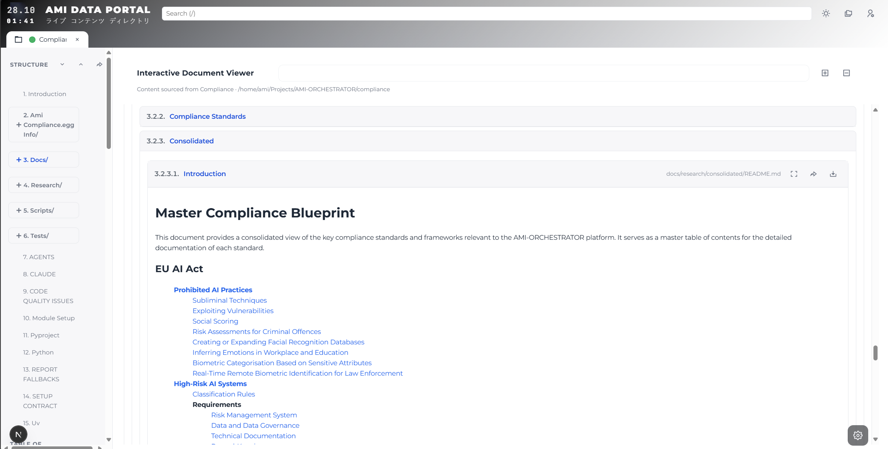

# AMI-ORCHESTRATOR

[](https://www.python.org/downloads/)

[](compliance/)
[](compliance/)
[](compliance/)

**THE OPEN-SOURCE HYPERSCALER**

Secure infrastructure for distributed enterprise automation and governance.
Supports bare metal, cloud, and hybrid deployments.
Connects to **any** web or API service.

Built for regulated industries demanding compliance, security, and complete operational transparency.
Accessible to every privacy-conscious professional.

**ISO** / **NIST** / **EU AI Act** compliant by design.



---

## Why AMI-ORCHESTRATOR

**Build your own hyperscaler without the hyperscale bills.**

Deploy on bare metal, private cloud, or hybrid infrastructure.
Multi-cloud orchestration without vendor lock-in.

### What You Get

**Infrastructure Orchestration**
- **Multi-Cloud Infrastructure as Code**: Full OpenTofu integration planned for vendor-neutral IaC (AWS, Azure, GCP, bare metal)
- **VM & Hypervisor Management**: Production-ready Windows VM orchestration with GPU passthrough (Hyper-V), Linux VM support in development
- **Service Launcher**: Unified orchestration for Docker containers, Python services, Node.js apps, and custom processes
- **Remote Machine Management**: Secure SSH-based fleet management via MCP protocol
- **Multi-Stack Deployment**: Pre-configured Docker Compose stacks for data (Postgres, Redis, MongoDB, Dgraph), services (Matrix, SearXNG, OpenVPN), and secrets (OpenBao)

**AI Agent Orchestration**
- **BPMN-Compatible Workflow Engine**: Business process automation with formal verification (in development)
- **Task Execution**: Worker/moderator pattern with automatic retry, timeout handling, and quality gates
- **Real-Time Streaming**: JSON streaming for live monitoring of all agent operations
- **Hook-Protected Operations**: Three-layer validation prevents destructive operations and ensures code quality

**Enterprise Web Platform**
- **AMI-PORTAL Distributed Content Management System**: Next.js-based content services & administration console with authentication, file management, and extensible architecture
- **Active Development**: Web UIs for Agent Management, DataOps, VM Orchestration, and Service Launcher control
- **Planned Modules**: KYC (Know Your Customer), KYE (Know Your Employee), Risk Management, Software Engineering (with AST analysis)
- **Web Automation Plugin**: Playwright-compatible Chrome extension for DOM-based automation trigger authoring and scenario execution
- **Secure Authentication**: NextAuth.js integration with multi-provider support

**Data & Storage**
- **Universal Storage Layer (Data Warehousing)**: Single API for 9 backends (Postgres/pgvector, MongoDB, Redis, Dgraph, OpenBao, Prometheus, File, REST) with automated high-availability, clustering, and migration capabilities
- **Vector Search**: Built-in pgvector support for AI/ML embeddings and semantic search
- **Graph Database**: Dgraph integration for complex relationship modeling
- **Secrets Management**: OpenBao for all secrets including cryptographic secrets, API keys, certificates, and user passwords

**Browser & Research Automation**
- **Chrome Automation**: Full browser control for testing, scraping, and RPA workflows
- **Meta-Search**: SearXNG integration for privacy-respecting search across 70+ engines
- **Research Tools**: Specialized MCP server for marketing research and data collection

**Communications & Networking**
- **Matrix Homeserver**: Self-hosted Synapse for team collaboration and ISMS compliance
- **Secure Messaging**: Element web client with end-to-end encryption
- **VPN Ready**: OpenVPN integration for secure remote access
- **Infrastructure Automation**: Custom OpenTofu runner with MCP servers for declarative infrastructure provisioning (replacing legacy tunnel automation)

**Virtual Machine Management**
- **Automated VM Provisioning**: One-command Ubuntu VM creation with Hyper-V on Windows
- **GPU Passthrough**: Direct Device Assignment (DDA) for ML training, gaming, or CAD workloads running in isolated VMs
- **Network Isolation**: Automatic NAT switch configuration with firewall rules for secure development environments
- **Linux Hypervisor Support**: KVM/libvirt integration in development for cross-platform VM orchestration


### Built for Regulated Industries

AMI-ORCHESTRATOR architecture implements compliance controls for regulated industries.

- **EU AI Act Ready**: Architecture maps directly to high-risk AI system requirements
- **ISO Certified Design**: Aligned with ISO 9001 (Quality), 27001 (Security), 42001 (AI Management)
- **NIST AI Framework**: Implements AI Risk Management Framework and Cybersecurity Framework controls
- **Complete Audit Trail**: Every operation logged with cryptographic provenance for regulatory inspection
- **Formal Verification**: Mathematical proofs of safety properties (in development)
- **Zero Trust Security**: Least-privilege access, secrets isolation, hook-based validation at every layer

**Four-Layer Compliance Architecture**
- **Layer 4: GOVERNANCE** → Policy enforcement, risk management, human oversight
- **Layer 3: INTELLIGENCE** → ML models, self-evolution engine, proof generators, knowledge graphs (specification only, target Q1-Q2 2026)
- **Layer 2: OPERATIONAL** → Secure isolated execution with cryptographic audit tokens
- **Layer 1: FOUNDATION** → Immutable safety axioms and compliance primitives

### ami-agent: Validated Automation CLI

```bash
ami-agent                       # Interactive AI agent with full MCP toolkit
ami-agent --audit base/         # Parallel code quality analysis across modules
ami-agent --tasks tasks/        # Execute complex multi-step workflows
ami-agent --docs docs/          # Intelligent documentation maintenance
ami-agent --sync base           # Safe git operations with pre-flight validation
```

**Features**
- **Zero Surprise Deployments**: Three-layer hook validation catches destructive operations before execution
- **Full Auditability**: Every operation logged to append-only session files with timestamps and structured context
- **Completion Verification**: Worker/moderator pattern detects and rejects premature completion claims
- **Real-Time Observability**: Streaming JSON output for integration with monitoring platforms
- **Parallel Execution**: Configurable concurrency with automatic retry and timeout management
- **MCP Protocol Native**: Seamless integration with 60+ tools across DataOps, SSH, Browser, Files, Launcher, and Research domains


### Three-Layer Validation System

Hooks validate operations before execution:

**1. Command Guard** (`command-guard`)
- **Prevents Catastrophic Mistakes**: Blocks `rm -rf`, force push, destructive git operations
- **Enforces Best Practices**: Requires dedicated tools over brittle pipes and redirects
- **Validates Permissions**: Ensures file operations respect security boundaries

**2. Code Quality Gate** (`code-quality`)
- **Pre-Flight Checks**: Validates all code changes before they touch your repository
- **Catches Common Bugs**: Identifies exception handling gaps, unchecked subprocess calls, security issues
- **Zero-Tolerance Policy**: Rejects low-quality code automatically - no manual review needed

**3. Completion Verification** (`response-scanner`)
- **Prevents False Success**: Moderator agent validates completion claims before accepting
- **Blocks Incomplete Work**: Rejects premature "WORK DONE" and forces continuation
- **Audit Trail**: Append-only logs of all completion attempts and moderator decisions

All three validators run automatically on every operation. Full audit logs available at `logs/hooks/{session_id}.log`.


### 60+ Tools Via Model Context Protocol

AMI-ORCHESTRATOR implements the Model Context Protocol (MCP). **63 tools** across 6 specialized servers provide structured access to infrastructure operations.

| Domain | Server | Business Value |
|--------|--------|----------------|
| **DataOps** | `base/scripts/run_dataops_fastmcp.py` | Query any database (Postgres, Mongo, Redis, Dgraph) through unified interface. No more per-database integration code. |
| **Remote Fleets** | `base/scripts/run_ssh_fastmcp.py` | Execute commands across hundreds of machines securely. Automatic authentication, logging, and error handling. |
| **Browser Automation** | `browser/scripts/run_chrome.py` | Automate web testing, data extraction, and user workflows. Screenshots, tab management, and headless operation. |
| **File Operations** | `files/scripts/run_filesys_fastmcp.py` | Safe filesystem access with extraction, validation, and audit trails. Prevents directory traversal attacks. |
| **Market Research** | `domains/marketing/scripts/run_research_mcp.py` | Automated competitor analysis, trend monitoring, and data collection from public sources. |
| **Service Management** | `nodes/scripts/run_launcher_mcp.py` | Start, stop, monitor services across Docker, Python, Node.js. Unified interface for heterogeneous stacks. |

All servers auto-configure from `scripts/config/automation.yaml`. Launch once, use everywhere.


### Real-World Workflows

```bash
# Find and fix security vulnerabilities across 10+ microservices in parallel
ami-agent --audit base/ browser/ files/ nodes/ --parallel

# Deploy infrastructure changes with pre-flight validation
ami-agent --tasks tasks/deploy-production.md --root-dir .

# Keep documentation synchronized with code automatically
ami-agent --docs docs/ --root-dir .

# Safe git operations with compliance checks
ami-agent --sync base --user-instruction "Add SSO authentication"

# Interactive AI agent with access to full infrastructure
ami-agent --interactive

# Run comprehensive test suite across all modules
./scripts/ami-run.sh scripts/run_tests.py

# Launch infrastructure services via nodes launcher
./scripts/ami-run.sh nodes/scripts/setup_service.py start <service>

# Secure remote command execution across server fleet
ami-run base/scripts/run_ssh_fastmcp.py

# Provision GPU-enabled Ubuntu VM with Hyper-V (Windows host)
cd nodes/scripts/vm/win && powershell -ExecutionPolicy Bypass -File main.ps1
```

### Get Started in 5 Minutes

**1. Bootstrap Your Hyperscaler**
```bash
git clone https://github.com/independent-ai-labs/ami-orchestrator
cd ami-orchestrator
python install.py  # Automated setup takes 2-3 minutes
```

This one command sets up:
- 8 specialized modules (base, browser, files, nodes, domains, compliance, streams, ux)
- Python 3.12 toolchain via `uv` (fastest Python package manager)
- Isolated virtual environments per module (no dependency conflicts)
- Pre-commit quality hooks (catch issues before they reach CI)
- Shell aliases (`ami-run`, `ami-uv`) for streamlined workflows

**2. Verify Everything Works**
```bash
./scripts/ami-run.sh base/scripts/run_tests.py  # Run base module tests
ami-agent --help                                 # Check CLI is installed
```

**3. Launch Your Infrastructure Stack**
```bash
# Launch infrastructure services via nodes launcher
./scripts/ami-run.sh nodes/scripts/setup_service.py start <service>

# Start the CMS (Next.js web platform)
cd ux/cms && npm install && npm run dev
```

**Basic infrastructure stack is now running.**


### MCP Servers

MCP servers expose infrastructure operations via structured protocol. Launch individually or use `ami-agent --interactive` to auto-load.

```bash
# Fleet management - SSH into any machine, run commands, collect outputs
ami-run base/scripts/run_ssh_fastmcp.py

# Universal database access - Postgres, Mongo, Redis, Dgraph via one interface
ami-run base/scripts/run_dataops_fastmcp.py

# Browser automation - Web scraping, testing, RPA without Selenium complexity
ami-run browser/scripts/run_chrome.py

# Safe file operations - Read, write, extract with automatic security validation
ami-run files/scripts/run_filesys_fastmcp.py --root-dir /path/to/files

# Market intelligence - Automated research and competitive analysis
ami-run domains/marketing/scripts/run_research_mcp.py

# Service orchestration - Start/stop/monitor services across heterogeneous stacks
ami-run nodes/scripts/run_launcher_mcp.py
```

**Configuration**: Edit `scripts/config/automation.yaml` → `mcp.servers` to customize which servers auto-load.

**Production Tip**: Run MCP servers as systemd services for 24/7 availability.

---

## Roadmap

AMI-ORCHESTRATOR development focuses on multi-cloud orchestration and compliance automation.

**Q4 2025 - Q1 2026: Infrastructure as Code**
- Full OpenTofu integration for multi-cloud provisioning
- Declarative infrastructure templates for AWS, Azure, GCP, and bare metal
- Automated disaster recovery and blue-green deployments

**Q1-Q2 2026: BPMN Workflow Engine**
- Visual business process modeling for complex automations
- Formal verification of workflow safety properties
- Integration with existing BPMN tools (Camunda, Flowable compatibility)

**Q2-Q3 2026: Advanced Compliance**
- Cryptographic State Tokens for immutable audit trails
- Secure Process Nodes (SPNs) with TEE support (Intel SGX, AMD SEV)
- Byzantine fault-tolerant verification for high-assurance AI

**Q4 2026: Self-Evolving AI (OpenAMI)**
- AI systems that prove their own safety before each improvement
- Never-jettison guarantee prevents value drift across 1000+ generations
- Complete implementation of formal verification pipeline

### Who Should Use AMI-ORCHESTRATOR

✅ **Regulated Industries**: Healthcare, finance, government, defense - anywhere compliance failures cost millions

✅ **Cost-Conscious Enterprises**: Teams tired of hyperscaler bills growing 40% YoY

✅ **On-Premise Requirements**: Organizations with data sovereignty, air-gap, or residency requirements

✅ **Open-Source First**: Companies committed to transparency, auditability, and avoiding vendor lock-in

✅ **AI/ML Teams**: Researchers and engineers building trustworthy AI with formal safety guarantees

### Why Open Source?

AMI-ORCHESTRATOR is MIT-licensed for transparency and auditability. No telemetry, no backdoors.

---

### License

MIT License - Copyright © 2025 Independent AI Labs

---

## Essential Resources

### 📚 Documentation & Guides
- **[Architecture Overview](docs/GUIDE-ARCHITECTURE-MAP.md)** - Understand the module structure and ownership model
- **[Quick Setup Guide](docs/GUIDE-TOOLCHAIN-BOOTSTRAP.md)** - Bootstrap Python 3.12, uv, and development environment
- **[Setup Contract](docs/SPEC-SETUP-CONTRACT.md)** - How modules integrate with the orchestrator
- **[Quality Standards](docs/POLICY-QUALITY.md)** - Zero-tolerance quality policy and enforcement mechanisms

### 🛡️ Compliance & Security
- **[OpenAMI Framework](docs/openami/README.md)** - Self-evolving AI with formal safety guarantees
- **[Executive Summary](docs/openami/overview/executive-summary.md)** - Business case for trustworthy AI
- **[System Architecture](docs/openami/architecture/system-architecture.md)** - Four-layer compliance architecture

### 🚀 Getting Started
1. **Clone**: `git clone https://github.com/independent-ai-labs/ami-orchestrator`
2. **Setup**: `python install.py` (automated bootstrap)
3. **Verify**: `./scripts/ami-run.sh base/scripts/run_tests.py`
4. **Deploy**: `./scripts/ami-run.sh nodes/scripts/setup_service.py start <service>`
5. **Explore**: `ami-agent --help`

### 💬 Community & Support
- **Issues**: [GitHub Issues](https://github.com/independent-ai-labs/ami-orchestrator/issues)
- **Contributing**: See [CONTRIBUTING.md](CONTRIBUTING.md) for guidelines
- **Security**: Report vulnerabilities to security@independentailabs.com

---
