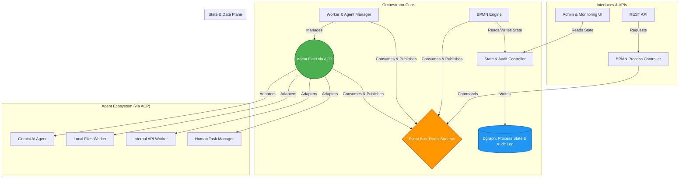

# OpenAMI Orchestrator: The Intelligent Process Automation Engine

## 1. Vision: The Core of OpenAMI

The OpenAMI Orchestrator is the foundational component of the OpenAMI (Advanced Machine Intelligence) framework. Its purpose is to serve as a multi-purpose, enterprise-grade reasoning engine designed to model, execute, and monitor complex business processes. It provides a robust, compliant, scalable, and intelligent platform for automating even the most dynamic and long-running business scenarios.

### Core Principles:

- **Auditability & Compliance:** Every action, decision, and state change is immutably logged, creating a comprehensive audit trail.
- **Resilience & Fault Tolerance:** Designed for high availability, gracefully handling failures with built-in retries, rollbacks, and human-in-the-loop escalations.
- **Scalability & Performance:** Horizontally scalable architecture, allowing independent scaling of all components to meet any workload demand, now enhanced with fine-grained parallelization and resource-specific worker pools.
- **Extensibility & Interoperability:** A standardized Agent-Coordinator Protocol (ACP) enables seamless integration of diverse services and AI models, now including a formalized AI Agent Interface and Data Exchange.
- **Intelligence & Adaptability:** More than a static workflow engine, it's a reasoning engine that uses AI for decision-making, real-time process adaptation, and automation of complex, non-deterministic tasks, leveraging dedicated AI agent interfaces.

## 2. Architectural Blueprint

The OpenAMI Orchestrator is built on a decoupled, event-driven architecture ensuring scalability and resilience.

```mermaid
graph TD
    subgraph "Interfaces & APIs"
        A[REST API] -- Requests --> B
        B[BPMN Process Controller]
        U[Admin & Monitoring UI]
    end

    subgraph "Orchestrator Core"
        B -- Commands --> C{Event Bus: Redis Streams}
        D[BPMN Engine] -- Consumes & Publishes --> C
        E[Worker & Agent Manager] -- Manages --> F((Agent Fleet via ACP))
        E -- Consumes & Publishes --> C
        G[State & Audit Controller] -- Writes --> H
    end

    subgraph "State & Data Plane"
        H[(Dgraph: Process State & Audit Log)]
    end

    subgraph "Agent Ecosystem (via ACP)"
        F -- Consumes & Publishes --> C
        F -- Adapters --> I[Gemini AI Agent]
        F -- Adapters --> J[Local Files Worker]
        F -- Adapters --> K[Internal API Worker]
        F -- Adapters --> L[Human Task Manager]
    end

    D -- Reads/Writes State --> G
    U -- Reads State --> G

    style H fill:#2196F3,stroke:#1976D2,stroke-width:2px,color:#fff
    style C fill:#FF9800,stroke:#E65100,stroke-width:2px,color:#fff
    style F fill:#4CAF50,stroke:#2E7D32,stroke-width:2px,color:#fff
```

## 3. Key Components

- **REST API:** Provides external interfaces for initiating processes, querying process status, and interacting with human tasks.
- **BPMN Engine:** The core execution engine responsible for parsing, interpreting, and executing BPMN 2.0 process definitions. It manages process state transitions and interacts with Dgraph for persistence.
- **Dgraph Client:** Manages interactions with the Dgraph graph database, handling process state persistence, audit logging, and schema management.
- **Redis Streams (Event Bus):** Serves as the high-performance, persistent message broker for all inter-component communication, enabling an event-driven architecture.
- **Worker & Agent Manager:** Responsible for managing the lifecycle of connected workers and AI agents, including registration, health checks, and task distribution via the Agent-Coordinator Protocol (ACP). Now supports resource-based worker pools (e.g., for Dgraph, Postgres, GPU, NPU) and parallelization using thread and process pools.
- **Agent Ecosystem (via ACP):** A flexible and extensible framework for integrating diverse specialized agents and workers (e.g., AI agents, file system workers, internal API workers, human task managers) that perform specific tasks within a BPMN process.

## 4. Getting Started

The Orchestrator is a complex system with multiple interacting components. To set up and run the system, the following steps are required:

1.  **Start Dependencies:** Ensure that instances of Redis and Dgraph are running and accessible.
2.  **Launch the Orchestrator:** Run the main Orchestrator service, which will initialize the BPMN engine and connect to the necessary services.
3.  **Launch Agents/Workers:** Start one or more agent processes (e.g., the Local Files Worker, a Gemini AI Agent). These agents will automatically register themselves with the Orchestrator via the ACP.
4.  **Initiate a Process:** Use the REST API or an administrative client to send a request to the Orchestrator to start a new BPMN process instance.

For detailed setup instructions, refer to the `DEVELOPMENT_PLAN.md` and `NEXT_STEPS.md` files.

## 5. Security & Compliance by Design

Security and compliance are not afterthoughts; they are core design principles:

-   **Authentication & Authorization:** All API endpoints will be protected by OAuth2/OIDC. Role-Based Access Control (RBAC) will govern all actions, from initiating a process to completing a human task.
-   **Secret Management:** All secrets (API keys, passwords, certificates) will be stored in VaultWarden and never in code or configuration files.
-   **Immutable Audit Log:** Every event and state change will be cryptographically signed and stored in an append-only log in Dgraph, creating an unbreakable chain of evidence.
-   **Data Encryption:** All data will be encrypted both in transit (TLS) and at rest.

## 6. Scalability & Resilience

-   **Horizontal Scaling:** All components are designed for independent horizontal scaling to handle varying workloads.
-   **Fault Tolerance:** Built-in mechanisms for retries, circuit breakers, and dead-letter queues ensure graceful degradation and recovery from failures.
-   **High Availability:** Components can be deployed in active-active or active-passive configurations across multiple availability zones.

## 7. Monitoring & Observability

-   **Metrics:** Comprehensive metrics will be collected from all components (BPMN engine, Dgraph, Redis, agents, adapters) including process instance counts, task execution times, agent performance, and resource utilization.
-   **Logging:** Custom logging based on Prometheus (for time-series metrics), Dgraph (for immutable audit logs through BPMN), and Postgres (for general application logs) provides granular control and optimized data storage.
-   **Tracing:** Distributed tracing (e.g., OpenTelemetry) will provide end-to-end visibility of requests flowing through the system.
-   **Alerting & Dashboards:** Critical metrics will have predefined alert thresholds, and Grafana dashboards will provide real-time visualization of all key metrics and system health.

## 8. Current Status & Next Steps

The Orchestrator project is currently in **Phase 1: Foundational Infrastructure & Security Core** and **Phase 2: Core BPMN Engine & State Machine** of its development plan. Significant progress has been made in establishing the core infrastructure, including a Flask API, Redis client, a functional BPMN engine with handlers for various BPMN elements, formalized AI agent interfaces, and initial support for parallelization and resource-based worker pools. All unit, integration, and end-to-end tests are currently passing.

For a detailed breakdown of completed tasks, current progress, and the next steps, please refer to the `DEVELOPMENT_PLAN.md` and `NEXT_STEPS.md` files.
