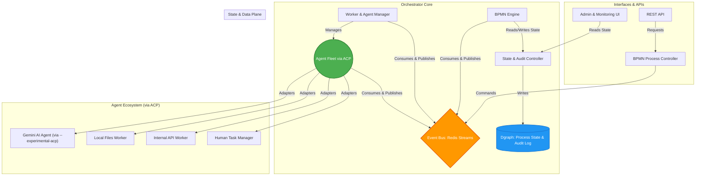

# OpenAMI Orchestrator: The Intelligent Process Automation Engine

## 1. Vision: The All-Mighty Orchestrator Agent - Your Unified Entry Point for Automation

The OpenAMI Orchestrator is the foundational component of the OpenAMI (Advanced Machine Intelligence) framework. Its purpose is to serve as a multi-purpose, enterprise-grade reasoning engine designed to model, execute, and monitor complex business processes. It provides a robust, compliant, scalable, and intelligent platform for automating even the most dynamic and long-running business scenarios. More than just a workflow engine, the Orchestrator acts as a central nervous system, coordinating work, providing actionable insights, and automating across diverse systems and platforms.

### Core Principles:

- **Auditability & Compliance:** Every action, decision, and state change is immutably logged, creating a comprehensive audit trail.
- **Resilience & Fault Tolerance:** Designed for high availability, gracefully handling failures with built-in retries, rollbacks, and human-in-the-loop escalations.
- **Scalability & Performance:** Horizontally scalable architecture, allowing independent scaling of all components to meet any workload demand, now enhanced with fine-grained parallelization and resource-specific worker pools.
- **Extensibility & Interoperability:** A standardized Agent-Coordinator Protocol (ACP), implemented as a JSON-RPC protocol over stdin/stdout (e.g., when Gemini runs in `--experimental-acp` mode), enables seamless integration of diverse services and AI models, now including a formalized AI Agent Interface and Data Exchange built on this protocol.
- **Intelligence & Adaptability:** More than a static workflow engine, it's a reasoning engine that uses AI for decision-making, real-time process adaptation, and automation of complex, non-deterministic tasks, leveraging dedicated AI agent interfaces.
- **Comprehensive Resource Management:** Beyond basic task execution, the Orchestrator provides advanced capabilities for managing diverse resources, including local and pooled hardware (CPU, GPU, NPU), remote metered services, subscriptions, human resources, time, and even environmental factors like energy consumption and Co2 emissions. It tracks, estimates, and predicts resource load, usage, and associated costs, enabling optimized allocation and cost control.

## 2. Architectural Blueprint

The OpenAMI Orchestrator is built on a decoupled, event-driven architecture ensuring scalability and resilience.


```mermaid
graph TD
    subgraph "Interfaces & APIs"
        A[REST API] -- Requests --> B
        B[BPMN Process Controller]
        U[Admin & Monitoring UI]
    end

    subgraph "Orchestrator Core"
        B -- Commands --> C{Event Bus: Redis Streams}
        D[BPMN Engine] -- Consumes & Publishes --> C
        E[Worker & Agent Manager] -- Manages --> F((Agent Fleet via ACP))
        E -- Consumes & Publishes --> C
        G[State & Audit Controller] -- Writes --> H
    end

    subgraph "State & Data Plane"
        H[(Dgraph: Process State & Audit Log)]
    end

    subgraph "Agent Ecosystem (via ACP)"
        F -- Consumes & Publishes --> C
        F -- Adapters --> I["Gemini AI Agent (via --experimental-acp)"]
        F -- Adapters --> J[Local Files Worker]
        F -- Adapters --> K[Internal API Worker]
        F -- Adapters --> L[Human Task Manager]
    end

    D -- Reads/Writes State --> G
    U -- Reads State --> G

    style H fill:#2196F3,stroke:#1976D2,stroke-width:2px,color:#fff
    style C fill:#FF9800,stroke:#E65100,stroke-width:2px,color:#fff
    style F fill:#4CAF50,stroke:#2E7D32,stroke-width:2px,color:#fff
```

## 3. Key Components

- **REST API:** Provides external interfaces for initiating processes, querying process status, and interacting with human tasks.
- **BPMN Engine:** The core execution engine responsible for parsing, interpreting, and executing BPMN 2.0 process definitions. It manages process state transitions and interacts with Dgraph for persistence.
- **Dgraph Client:** Manages interactions with the Dgraph graph database, handling process state persistence, audit logging, and schema management.
- **Redis Streams (Event Bus):** Serves as the high-performance, persistent message broker for all inter-component communication, enabling an event-driven architecture.
- **Worker & Agent Manager:** Responsible for managing the lifecycle of connected workers and AI agents, including registration, health checks, and task distribution via the Agent-Coordinator Protocol (ACP). Now supports resource-based worker pools (e.g., for Dgraph, Postgres, GPU, NPU) and parallelization using thread and process pools.
- **Agent Ecosystem (via ACP):** A flexible and extensible framework for integrating diverse specialized agents and workers (e.g., AI agents like Gemini running with `--experimental-acp` mode, file system workers, internal API workers, human task managers) that perform specific tasks within a BPMN process. This ecosystem is the backbone for extending the Orchestrator's automation capabilities.
- **LocalFS MCP Server:** A dedicated MCP server that provides a comprehensive and secure toolset for local file system operations. The server exposes a range of tools, including `list_dir`, `create_dirs`, `find_paths`, `read_file`, `write_file`, `delete_paths`, `modify_file`, and `replace_content_in_file`, enabling robust and granular file manipulation capabilities.

## 4. Getting Started

The Orchestrator is a complex system with multiple interacting components. To set up and run the system, the following steps are required:

1.  **Start Dependencies:** Ensure that instances of Redis and Dgraph are running and accessible.
2.  **Launch the Orchestrator Agent:** Run the main Orchestrator agent, which will initialize the BPMN engine and connect to the necessary services.

    ```bash
    python orchestrator/main.py
    ```

3.  **Interact with the Agent:** The agent will provide a command-line interface for interacting with the orchestrator. You can use this interface to register workers, start processes, and monitor the system.

For detailed setup instructions, refer to the `DEVELOPMENT_PLAN.md` and `NEXT_STEPS.md` files.

## 5. Security & Compliance by Design

Security and compliance are not afterthoughts; they are core design principles:

-   **Authentication & Authorization:** All API endpoints will be protected by OAuth2/OIDC. Role-Based Access Control (RBAC) will govern all actions, from initiating a process to completing a human task.
-   **Secret Management:** All secrets (API keys, passwords, certificates) will be stored in VaultWarden and never in code or configuration files.
-   **Immutable Audit Log:** Every event and state change will be cryptographically signed and stored in an append-only log in Dgraph, creating an unbreakable chain of evidence.
-   **Data Encryption:** All data will be encrypted both in transit (TLS) and at rest.

## 6. Scalability & Resilience
## 4. BPMN and Operational Management: Bridging Model and Execution

The OpenAMI Orchestrator leverages BPMN 2.0 not just for process modeling, but as a blueprint for robust operational management and resource orchestration. While BPMN defines the "what" and "who" of a process, the Orchestrator provides the "how" and "when" in a dynamic, intelligent execution environment.

### Resource Allocation and Workload Distribution

BPMN's **Pools** and **Lanes** are directly translated into the Orchestrator's resource management capabilities:
- **Pools** represent distinct participants (e.g., departments, external systems) and define the boundaries of responsibility within a process.
- **Lanes** within a Pool are used to assign specific roles, teams, or automated agents to activities, enabling clear visualization and execution of workload distribution. The Orchestrator dynamically allocates tasks to available workers and agents based on these assignments, considering factors like current load, resource availability, and performance metrics.

### Dynamic Resource Optimization and Real-time Adaptation

The Orchestrator goes beyond static process execution by incorporating AI-driven intelligence for real-time operational adjustments:
- **Intelligent Task Routing:** Based on defined BPMN flows and real-time operational data, the Orchestrator can intelligently route tasks to the most suitable and available resources (human or automated), optimizing for speed, cost, or specific performance targets.
- **Adaptive Process Flows:** In response to unforeseen events or changing conditions (e.g., resource unavailability, system failures, high demand), the Orchestrator can dynamically adapt process flows, re-routing tasks, initiating alternative paths, or escalating to human intervention as modeled in BPMN.
- **Resource-Specific Worker Pools:** The "Worker & Agent Manager" supports resource-based worker pools (e.g., for CPU, GPU, NPU, specific software licenses), allowing the Orchestrator to manage and optimize the utilization of diverse computational and human resources.

### Operational Insights and Performance Metrics

The Orchestrator's comprehensive monitoring and observability features provide deep insights into process performance and resource utilization, directly supporting operational management:
- **Key Performance Indicators (KPIs):** Metrics such as process cycle times, task execution durations, resource utilization rates, and throughput are collected and made available for analysis.
- **Real-time Monitoring:** Dashboards and alerting mechanisms provide real-time visibility into the health and progress of processes, allowing operators to identify and address bottlenecks or anomalies proactively.
- **Auditability:** Every process step and resource interaction is logged, providing a complete audit trail for compliance and post-mortem analysis.

By integrating these operational management capabilities with BPMN, the OpenAMI Orchestrator transforms process models into living, adaptable, and highly efficient automated workflows.

-   **Horizontal Scaling:** All components are designed for independent horizontal scaling to handle varying workloads.
-   **Fault Tolerance:** Built-in mechanisms for retries, circuit breakers, and dead-letter queues ensure graceful degradation and recovery from failures.
-   **High Availability:** Components can be deployed in active-active or active-passive configurations across multiple availability zones.

## 7. Monitoring & Observability

-   **Metrics:** Comprehensive metrics will be collected from all components (BPMN engine, Dgraph, Redis, agents, adapters) including process instance counts, task execution times, agent performance, and resource utilization.
-   **Logging:** Custom logging based on Prometheus (for time-series metrics), Dgraph (for immutable audit logs through BPMN), and Postgres (for general application logs) provides granular control and optimized data storage.
-   **Tracing:** Distributed tracing (e.g., OpenTelemetry) will provide end-to-end visibility of requests flowing through the system.
-   **Alerting & Dashboards:** Critical metrics will have predefined alert thresholds, and Grafana dashboards will provide real-time visualization of all key metrics and system health.

## 8. Current Status & Next Steps

The Orchestrator project is actively under development, with significant progress made in establishing its core infrastructure, BPMN engine, and agent integration. All unit, integration, and end-to-end tests are currently passing.

For a detailed breakdown of completed tasks, current progress, and the next steps, please refer to the `DEVELOPMENT_PLAN.md` and `NEXT_STEPS.md` files.

## 9. Code Quality and Pre-Commit Hooks

This project enforces code quality and consistency through a robust pre-commit setup, utilizing `ruff` for linting and formatting, and `mypy` for type checking. This ensures that all code adheres to established standards before it is committed.

### Pre-Commit Configuration

The `.pre-commit-config.yaml` file at the root of the `orchestrator` directory defines the hooks that are run automatically before each commit and push. These include:

-   **Ruff:** Used for both linting (including security checks) and code formatting, replacing tools like `black`, `isort`, `pylint`, and `bandit`.
-   **Ruff-format:** Used for code formatting.
-   **MyPy:** Ensures static type checking for Python code, catching potential type-related errors early in the development cycle.
-   **MyPy (tests):** Ensures static type checking for Python test code.
-   **Pytest:** Runs unit and integration tests as a `pre-push` hook to prevent regressions.
-   **check-yaml:** Checks YAML file syntax.
-   **check-added-large-files:** Prevents committing large files.
-   **check-merge-conflict:** Checks for merge conflict strings.
-   **debug-statements:** Prevents committing files with debug statements.

To ensure all checks are run, install the pre-commit hooks by navigating to the `orchestrator` directory and running:

```bash
pre-commit install
pre-commit install --hook-type pre-push
```

This setup guarantees that code quality is maintained throughout the development process, providing immediate feedback on potential issues.
