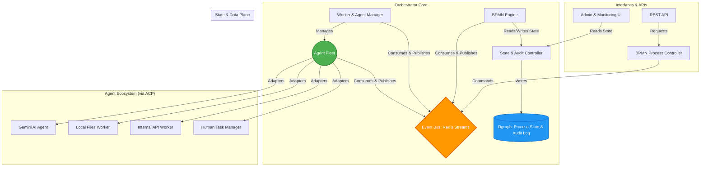

# OpenAMI Orchestrator: The Intelligent Process Automation Engine

## 1. Vision: The Core of OpenAMI

The OpenAMI Orchestrator is the foundational component of the OpenAMI (Advanced Machine Intelligence) framework. Its purpose is to serve as a multi-purpose, enterprise-grade reasoning engine designed to model, execute, and monitor complex business processes. It provides a robust, compliant, scalable, and intelligent platform for automating even the most dynamic and long-running business scenarios.

### Core Principles:

- **Auditability & Compliance:** Every action, decision, and state change is immutably logged, creating a comprehensive audit trail.
- **Resilience & Fault Tolerance:** Designed for high availability, gracefully handling failures with built-in retries, rollbacks, and human-in-the-loop escalations.
- **Scalability & Performance:** Horizontally scalable architecture, allowing independent scaling of all components to meet any workload demand.
- **Extensibility & Interoperability:** A standardized Agent-Coordinator Protocol (ACP) enables seamless integration of diverse services and AI models.
- **Intelligence & Adaptability:** More than a static workflow engine, it's a reasoning engine that uses AI for decision-making, real-time process adaptation, and automation of complex, non-deterministic tasks.

## 2. Architectural Blueprint

The OpenAMI Orchestrator is built on a decoupled, event-driven architecture ensuring scalability and resilience.

```mermaid
graph TD
    subgraph "Interfaces & APIs"
        A[REST API] -- Requests --> B
        B[BPMN Process Controller]
        U[Admin & Monitoring UI]
    end

    subgraph "Orchestrator Core"
        B -- Commands --> C{Event Bus: Redis Streams}
        D[BPMN Engine] -- Consumes & Publishes --> C
        E[Worker & Agent Manager] -- Manages --> F((Agent Fleet))
        E -- Consumes & Publishes --> C
        G[State & Audit Controller] -- Writes --> H
    end

    subgraph "State & Data Plane"
        H[(Dgraph: Process State & Audit Log)]
    end

    subgraph "Agent Ecosystem (via ACP)"
        F -- Consumes & Publishes --> C
        F -- Adapters --> I[Gemini AI Agent]
        F -- Adapters --> J[Local Files Worker]
        F -- Adapters --> K[Internal API Worker]
        F -- Adapters --> L[Human Task Manager]
    end

    D -- Reads/Writes State --> G
    U -- Reads State --> G

    style H fill:#2196F3,stroke:#1976D2,stroke-width:2px,color:#fff
    style C fill:#FF9800,stroke:#E65100,stroke-width:2px,color:#fff
    style F fill:#4CAF50,stroke:#2E7D32,stroke-width:2px,color:#fff
```

## 3. Key Components

- **Orchestrator Core:** The central brain that listens for external API calls and internal events, initiating and driving the execution of BPMN processes.
- **BPMN Engine:** Parses and interprets process definitions, managing state transitions within the Dgraph database.
- **Dgraph Client:** A dedicated client for all interactions with the graph database, handling schema management and state persistence.
- **Redis Streams:** The high-performance message bus for all inter-component communication, providing a persistent, scalable, and reliable event log.
- **Worker Manager:** Responsible for discovering, registering, and monitoring the health of all connected agents and workers.
- **Agent Ecosystem (via ACP):** A flexible framework for integrating diverse specialized agents and workers, each with specific capabilities (e.g., file manipulation, AI analysis, human interaction).

## 4. Getting Started

The Orchestrator is a complex system with multiple interacting components. To set up and run the system, the following steps are required:

1.  **Start Dependencies:** Ensure that instances of Redis and Dgraph are running and accessible.
2.  **Launch the Orchestrator:** Run the main Orchestrator service, which will initialize the BPMN engine and connect to the necessary services.
3.  **Launch Agents/Workers:** Start one or more agent processes (e.g., the Local Files Worker, a Gemini AI Agent). These agents will automatically register themselves with the Orchestrator via the ACP.
4.  **Initiate a Process:** Use the REST API or an administrative client to send a request to the Orchestrator to start a new BPMN process instance.

## 5. Security & Compliance by Design

Security and compliance are paramount and are integrated into the core design:

-   **Authentication & Authorization:** All API endpoints are protected by OAuth2/OIDC. Role-Based Access Control (RBAC) governs all actions.
-   **Secret Management:** All sensitive information is stored in a secure vault.
-   **Immutable Audit Log:** Every event and state change is cryptographically signed and stored in an append-only log in Dgraph, creating an unbreakable chain of evidence.
-   **Data Encryption:** All data is encrypted both in transit (TLS) and at rest.

## 6. Scalability & Resilience

-   **Horizontal Scaling:** All components are designed for independent horizontal scaling to handle varying workloads.
-   **Fault Tolerance:** Built-in mechanisms for retries, circuit breakers, and dead-letter queues ensure graceful degradation and recovery from failures.
-   **High Availability:** Components can be deployed in active-active or active-passive configurations across multiple availability zones.

## 7. Monitoring & Observability

-   **Comprehensive Metrics:** Detailed metrics are collected from all components, covering process execution, task performance, agent health, and resource utilization.
-   **Structured Logging:** All logs are structured and centralized for easy analysis and auditing.
-   **Distributed Tracing:** End-to-end tracing provides visibility into requests flowing through the system.
-   **Alerting & Dashboards:** Critical metrics trigger alerts, and Grafana dashboards provide real-time visualization of system health.

## 8. Current Status & Next Steps

### Current Status

- **Linting and Static Analysis:**
    - `orchestrator/mcp/mcp_server_manager.py`: Syntax errors resolved. Pylint score improved to 9.08/10. Bandit warnings addressed.
    - `orchestrator/mcp/servers/localfs/local_file_server.py`: Syntax errors resolved. Pylint score improved to 8.60/10. Bandit warnings addressed.
    - `orchestrator/tests/mcp_server/integration_test_local_file_server.py`: Syntax errors resolved. Pylint score improved to 8.60/10. Bandit warnings addressed.

### Next Steps

- **Continue Linting and Static Analysis:** Address remaining Pylint warnings in all `orchestrator` modules, focusing on code complexity and style.
- **Implement Core BPMN Engine:** Begin development of the BPMN engine as outlined in the `DEVELOPMENT_PLAN.md`.
- **Integrate First Agent:** Implement the first agent adapter and integrate it with the Orchestrator.
- **Pre-commit Hooks:** Pre-commit hooks are installed and configured to ensure code quality.
